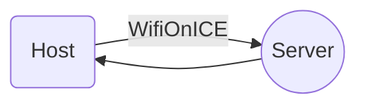

# ICE Portal Dokumentation

Dies ist die Doku des ICEPortals der Deutschen Bahn.

## URL / Endpoint

    https://iceportal.de/api1/rs/tripInfo/trip
Die URL benötigt KEINE authentication und kann einfach aufgerufen werden.

## Voraussetzungen

Das Gerät was auf die Daten Zugriff haben möchte, muss mit dem ICE WLAN (WifiOnICE) verbunden sein.

## Ausgabe

Wird bald noch hinzugefügt. Müssen erstmal wieder ICE fahren :P

## Serialisierung (Beispiel)

Beispiele zur Serialisierung gibt es im Source Code von *The Public Transport*

Links: 
https://github.com/thepublictransport/thepublictransport-app/blob/master/lib/backend/models/core/ICEPortalModel.dart
https://github.com/thepublictransport/thepublictransport-app/tree/master/lib/backend/models/iceportal
https://github.com/thepublictransport/thepublictransport-app/blob/master/lib/backend/service/iceportal/ICEPortalService.dart
